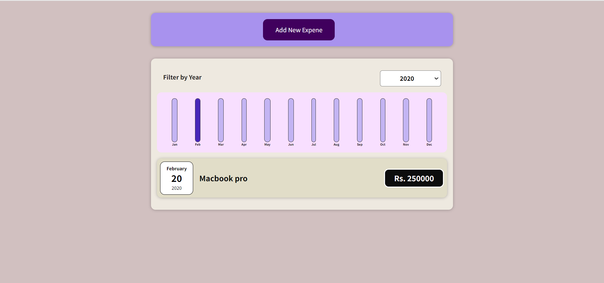
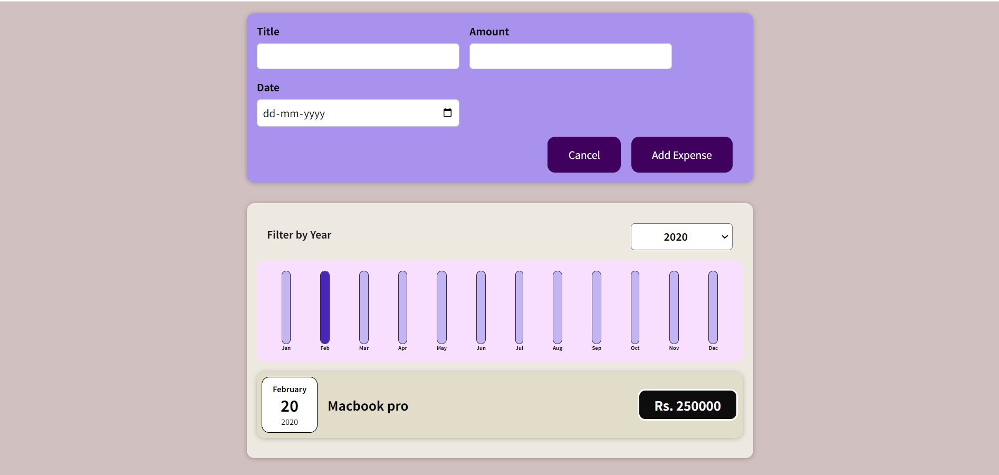
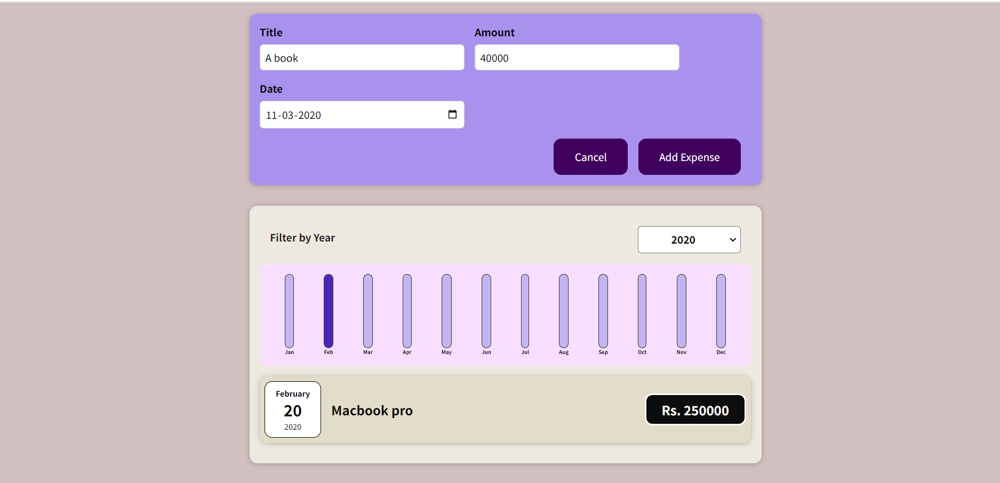
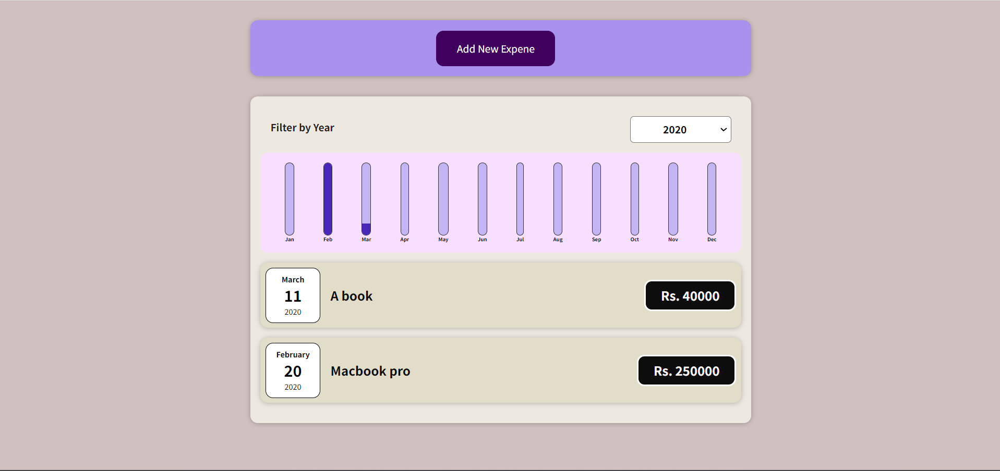
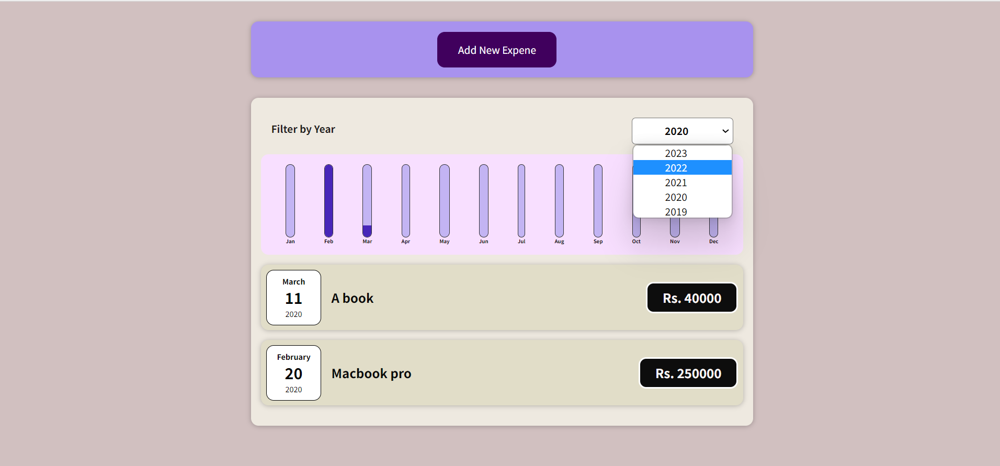

# Expense Tracker

Expense Tracker is a simple web application that helps you track and manage your expenses. It provides a user-friendly interface to add, view, and categorize your expenses, giving you a clear overview of your financial situation.

## Features

- **Expense Management:** Users can add expenses, including information such as the amount, date, and description.
- **Expense Filtering:** Users can filter and sort expenses based on different criteria, such as date, category, or amount, to easily find specific expenses.
- **Expense Statistics:** The application provides visual representations of expense data, such as charts and graphs, to give users insights into their spending patterns and help them make informed financial decisions.

## Technologies Used

The Expense Tracker project is built using the following technologies:

- **Frontend:** ReactJs, React(useState Hook).


## Getting Started

To get started with the Expense Tracker project, follow these steps:

1. Clone the repository:

   ```bash
   git clone https://github.com/rushikesh5045/expense_tracker.git
   ```

2. Install the dependencies:

   ```bash
   cd expense_tracker
   npm install
   ```

3. Start the application:

   ```bash
   npm start
   ```

4. Open your web browser and navigate to `http://localhost:3000` to access the Expense Tracker application.

## Screenshots











## Contributing

Contributions are welcome! If you have any ideas, suggestions, or bug reports, please create an issue or submit a pull request.

Before contributing, please read our [Contributing Guidelines](CONTRIBUTING.md) for more information.

## License

This project is licensed under the [MIT License](LICENSE).

## Acknowledgments

- The Expense Tracker project was inspired by the need for a simple and efficient expense management tool.
- We would like to express our gratitude to the open-source community for their contributions and support.

## Contact

If you have any questions, suggestions, or feedback, please feel free to contact the project maintainer:

- Name: Rushikesh
- GitHub: [@rushikesh5045](https://github.com/rushikesh5045)
- Email: rushikeshkadam515@gmail.com

We hope you find the Expense Tracker project useful and enjoy using it to manage your expenses effectively!
